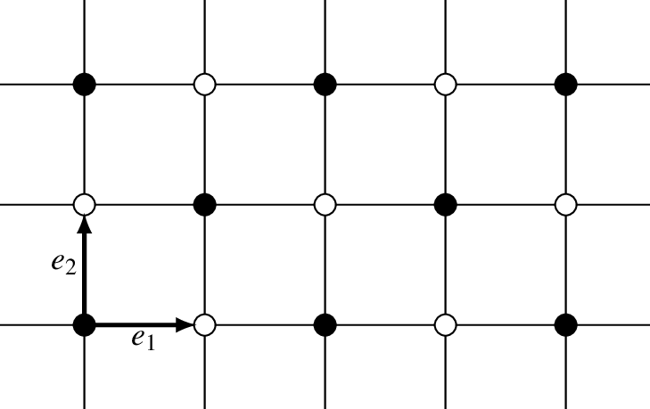

.. vdw_evolve documentation master file, created by
   sphinx-quickstart on Sat Oct 15 13:03:55 2022.
   You can adapt this file completely to your liking, but it should at least
   contain the root `toctree` directive.

Examples 
========

Minimal Supercell
___________________

A Bravais lattice is a discrete collection of infinite points all related by a set of discrete translations follow a pattern. For instance, in two dimensions 
this means that a lattices is the collections of points :math:`R(n_1,n_2)` that satisfies the following equation

.. math::
   R(n_1,n_2) = n_1 \mathbf{a}_1 + n_2 \mathbf{a}_2, 

where :math:`\mathbf{a}_1` and :math:`\mathbf{a}_2` two noncollinear two-dimensional vectors known as the lattice vectors. An example of a lattice is presented
below:

.. image:: images/example0_honeycomb_lattice.svg
   :width: 600

Unit cell
*********

For convenience, let us group the lattice vectors as columns in a :math:`2\times2` matrix 

.. math::
   A = \left( \begin{array}{cc}
               \mathbf{a}_1|_1 & \mathbf{a}_2|_1 \\
               \mathbf{a}_1|_2 & \mathbf{a}_2|_2
      \end{array} \right).

The determinant of matrix :math:`A` describes the area of the plane formed by the lattice vectors, and within this area there is a collection of points. 
This collection of points is known as unit cell, and represent a possible subset of points that can be translate with these unit vectors that fully represents 
the lattice. We will call the matrix :math:`A` unit cell matrix. 

Van der Waal cells
******************

Let us consider know, another lattice B, represent by the unit cell matrix

.. math::
   B = \left( \begin{array}{cc}
               \mathbf{b}_1|_1 & \mathbf{b}_2|_1 \\
               \mathbf{b}_1|_2 & \mathbf{b}_2|_2
      \end{array} \right).

for instance, this could be a lattice with a different symmetry such a square one

Optimal Fermi Contour
_____________________

